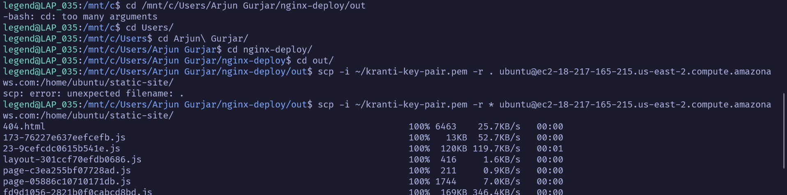

Arre Aman bhai, ab tu full relax ho ja. Chal, step-by-step samjhte hain kaise key file ko Linux Subsystem mein copy karna hai aur permissions set karni hain. Hum do approaches discuss karenge: pehla approach key file ko Linux Subsystem mein move karna aur doosra approach metadata enable karna takki Windows file system mein Linux permissions retain ho sakein.

### Approach 1: Copy Key File to Linux Subsystem and Set Permissions

#### **Step 1: Open WSL Terminal**

1. **Open WSL (Ubuntu) Terminal:**
   - WSL (Ubuntu) ko Start menu se open kar.

#### **Step 2: Navigate to the Key Pair File Location**

1. **Change Directory to Downloads:**
   - Command:
     ```sh
     cd /mnt/c/Users/Arjun\ Gurjar/Downloads
     ```

2. **List Files to Check Key File:**
   - Command:
     ```sh
     ls -l kranti-key-pair.pem
     ```

#### **Step 3: Copy Key File to WSL Home Directory**

1. **Copy Key File:**
   - Command:
     ```sh
     cp kranti-key-pair.pem ~/
     ```

2. **Navigate to Home Directory:**
   - Command:
     ```sh
     cd ~
     ```

3. **List Files to Verify Copy:**
   - Command:
     ```sh
     ls -l kranti-key-pair.pem
     ```

#### **Step 4: Set Correct Permissions in Home Directory**

1. **Set Permissions to 400:**
   - Command:
     ```sh
     chmod 400 kranti-key-pair.pem
     ```

2. **Verify Permissions:**
   - Command:
     ```sh
     ls -l kranti-key-pair.pem
     ```

3. **Expected Output:**
   - The output should now show:
     ```sh
     -r-------- 1 legend legend 387 May 19 12:26 kranti-key-pair.pem
     ```

#### **Step 5: Use SSH with Correct Permissions**

1. **Connect Using SSH:**
   - Command:
     ```sh
     ssh -i ~/kranti-key-pair.pem ubuntu@ec2-18-223-97-225.us-east-2.compute.amazonaws.com
     ```

### Approach 2: Enable Metadata for Windows File System in WSL

#### **Step 1: Open WSL Terminal**

1. **Open WSL (Ubuntu) Terminal:**
   - WSL (Ubuntu) ko Start menu se open kar.

#### **Step 2: Edit or Create /etc/wsl.conf**

1. **Open /etc/wsl.conf with sudo:**
   - Command:
     ```sh
     sudo nano /etc/wsl.conf
     ```

2. **Add the Following Content:**
   - Content:
     ```sh
     [automount]
     options = "metadata"
     ```

3. **Save and Exit:**
   - Press `Ctrl + X`, then `Y`, then `Enter` to save and exit.

#### **Step 3: Restart WSL**

1. **Shut Down All WSL Instances:**
   - Command:
     ```sh
     wsl --shutdown
     ```

2. **Restart WSL:**
   - Open WSL (Ubuntu) again from the Start menu.

#### **Step 4: Navigate to the Key Pair File Location and Set Permissions**

1. **Change Directory to Downloads:**
   - Command:
     ```sh
     cd /mnt/c/Users/Arjun\ Gurjar/Downloads
     ```

2. **Set Permissions to 400:**
   - Command:
     ```sh
     chmod 400 kranti-key-pair.pem
     ```

3. **Verify Permissions:**
   - Command:
     ```sh
     ls -l kranti-key-pair.pem
     ```

4. **Expected Output:**
   - The output should now show:
     ```sh
     -r-------- 1 legend legend 387 May 19 12:26 kranti-key-pair.pem
     ```

#### **Step 5: Use SSH with Correct Permissions**

1. **Connect Using SSH:**
   - Command:
     ```sh
     ssh -i /mnt/c/Users/Arjun\ Gurjar/Downloads/kranti-key-pair.pem ubuntu@ec2-18-223-97-225.us-east-2.compute.amazonaws.com
     ```

### Summary Tapori Style Mein:

1. **Approach 1:**
   - WSL open kar aur Downloads pe jaa:
     ```sh
     cd /mnt/c/Users/Arjun\ Gurjar/Downloads
     ```
   - Key file ko home directory mein copy kar:
     ```sh
     cp kranti-key-pair.pem ~/
     ```
   - Home directory pe jaa aur permissions set kar:
     ```sh
     cd ~
     chmod 400 kranti-key-pair.pem
     ls -l kranti-key-pair.pem
     ```
   - SSH command se connect kar:
     ```sh
     ssh -i ~/kranti-key-pair.pem ubuntu@ec2-18-223-97-225.us-east-2.compute.amazonaws.com
     ```

2. **Approach 2:**
   - WSL open kar aur `/etc/wsl.conf` file edit kar:
     ```sh
     sudo nano /etc/wsl.conf
     ```
   - Metadata option add kar aur save karke exit kar:
     ```sh
     [automount]
     options = "metadata"
     ```
   - WSL shutdown aur restart kar:
     ```sh
     wsl --shutdown
     ```
   - Downloads pe jaa aur permissions set kar:
     ```sh
     cd /mnt/c/Users/Arjun\ Gurjar/Downloads
     chmod 400 kranti-key-pair.pem
     ls -l kranti-key-pair.pem
     ```
   - SSH command se connect kar:
     ```sh
     ssh -i /mnt/c/Users/Arjun\ Gurjar/Downloads/kranti-key-pair.pem ubuntu@ec2-18-223-97-225.us-east-2.compute.amazonaws.com
     ```

Yeh sab steps follow karke tu apne file permissions issue ko fix kar sakta hai aur apne EC2 instance se successfully connect ho sakta hai. Mazedaar coding aur deployment kar, bhai!


The error you're encountering with SCP indicates that there's a misunderstanding in the command syntax, particularly with the use of `.` to denote the current directory. This should generally work, but SCP can be finicky about syntax, especially regarding spaces and argument parsing.

Here's how you can correct this and ensure a successful transfer:

### Proper SCP Command Syntax

The proper way to specify that you want to copy all files and directories in the current directory (denoted by `.`) to the remote server is straightforward, but every element in the command must be correctly placed:

1. **Ensure No Extra Spaces**: Sometimes, extra spaces or unusual characters can disrupt command parsing. Make sure there's no unnecessary whitespace in your command, especially around the colon (`:`) after the server address.

2. **Use the Correct Command**:
   Make sure you’re in the directory containing the files you want to transfer (`/mnt/c/Users/Arjun Gurjar/nginx-deploy/out`), and run:

```bash
scp -i ~/kranti-key-pair.pem -r * ubuntu@ec2-18-217-165-215.us-east-2.compute.amazonaws.com:/home/ubuntu/static-site/
```

In this corrected command:
- `-r *` specifies that all files and directories in the current directory should be recursively copied.
- Ensure there is no space between the server address and the path (`ubuntu@ec2-18-217-165-215.us-east-2.compute.amazonaws.com:/home/ubuntu/static-site/`).

### Steps to Follow

1. **Open WSL and Navigate to the Correct Directory**:
   ```bash
   cd /mnt/c/Users/Arjun Gurjar/nginx-deploy/out
   ```

2. **Run the SCP Command**:
   ```bash
   scp -i ~/kranti-key-pair.pem -r * ubuntu@ec2-18-217-165-215.us-east-2.compute.amazonaws.com:/home/ubuntu/static-site/
   ```

   This command tells SCP to:
   - Use the SSH key at `~/kranti-key-pair.pem`.
   - Recursively copy all files from the current directory.
   - Transfer them to the EC2 instance under `/home/ubuntu/static-site/`.

### Troubleshooting

- **Check for Typos**: Verify there are no typos in the command.
- **Permissions on the SSH Key**: Ensure the SSH key (`kranti-key-pair.pem`) has the correct permissions. You might need to run `chmod 400 ~/kranti-key-pair.pem` again if permissions have been changed.
- **Connectivity Issues**: Make sure your EC2 instance is running, and your IP is allowed to connect via the instance's security group settings.

This should resolve the issue with the unexpected filename error in SCP. If you still encounter problems, it could be helpful to manually list the files (`ls -la`) to ensure you are in the correct directory and the files you expect to transfer are indeed there.




Acha, chalo step by step dekhte hain ki kaise check karna hai aur troubleshoot karna hai.

### Public IP Address Verify Karna

1. **AWS Console Check**: AWS Management Console pe jaao, aur EC2 Dashboard pe navigate karo. Wahan pe apne instance ka selection karo, aur description tab me jaake dekho ki "IPv4 Public IP" kya listed hai. Ye wahi IP hai jo tu use karna chahta hai website ko access karne ke liye.

2. **Elastic IP**: Agar tu chahta hai ki tera IP address restarts ke baad bhi same rahe, to tu Elastic IP configure kar sakta hai. Ye static public IP hota hai jo tere instance se link hota hai. Elastic IP ko allocate karne aur apne instance se associate karne ke liye bhi AWS console ka use kar sakte ho.

### Netstat Command Not Found

Agar `netstat` command not found aa raha hai, iska matlab hai ki `net-tools` package installed nahi hai jo ki `netstat` command provide karta hai. Tu ise install kar sakta hai using:

```bash
sudo apt update
sudo apt install net-tools
```

Iske baad, `netstat` command ka use karke check kar sakte ho ki Nginx kaun se port pe listen kar raha hai:

```bash
sudo netstat -plntu | grep nginx
```

### Nginx Configuration Verify Karna

Nginx configuration file ko verify karna important hai. Yeh usually `/etc/nginx/sites-available/default` ya `/etc/nginx/nginx.conf` me located hota hai. Ensure karo ki is file me jo `server` block hai usme `listen` directive properly set hai port 80 ya 443 (for HTTPS) pe, jaise ki:

```nginx
server {
    listen 80;
    server_name example.com www.example.com;  # Replace with your domain or public IP

    location / {
        root /var/www/html;  # Ensure this directory path is correct
        index index.html index.htm;
        try_files $uri $uri/ =404;
    }

    error_page 404 /404.html;
    location = /404.html {
        root /var/www/html;
        internal;
    }
}
```

### SSL aur SSH Access

Security groups me agar HTTPS aur SSH allow kiya hua hai toh achha hai, lekin ye bhi ensure karo ki Nginx SSL configuration sahi se setup ho agar tu HTTPS use kar raha hai. Iske liye SSL certificate ki zarurat padegi aur Nginx configuration me SSL settings properly configure hone chahiye.

### Summary

- **Public IP Address**: Ensure karo ki IP address sahi hai aur AWS console se match karta hai.
- **Netstat**: `net-tools` install karne ke baad `netstat` se check karo ki Nginx kaun se port par sun raha hai.
- **Nginx Configuration**: Configuration file me sahi settings ensure karo.

Ye steps follow karne ke baad, agar sab kuch correctly set up hai toh tu apne website ko successfully access kar paayega through the provided public IP address. Agar kuch aur assistance chahiye, to bata dena!

sudo nginx -t
sudo systemctl reload nginx
sudo apt update
sudo apt install net-tools
sudo netstat -plntu | grep nginx
sudo systemctl restart   nginx
sudo systemctl restart or status nginx
sudo nano /etc/nginx/sites-available/default


Chalo, ek baar phir se, is baar ek simple analogy ke sath:

### Let’s Encrypt ke Pura Process samjhane ke liye hum ek "Property Registration" analogy use karenge:

#### **Step 1: Domain Validation**
Socho tum ek property (apna website domain) register karna chahte ho. Lekin registrar (Let's Encrypt) ko yeh prove karna hai ki tumhi asli owner ho us property ka.

**Kaise?**
- **DNS Record Set Karna:** Tumhare domain ke DNS me ek record add karo jo kehta hai "Haan, yeh domain is bande ka hai."
- **HTTP File Upload Karna:** Ek specific file ko tumhare domain ke server par ek specific jagah pe upload karo jaise registrar ne kaha.

Jab tum yeh task complete karte ho, tum basically registrar ko bata rahe ho ki "Dekho, maine jo bola tha, dekho kar liya!"

#### **Step 2: Getting Authorized**
Jab tumne yeh sab kar diya, Let's Encrypt check karta hai ki kya sach me tumne yeh kaam kiya hai. Agar tumne sahi se kiya hai to, wo tumhe ek "authorization" deta hai, matlab ab tum officially us domain ka owner maane jaoge.

#### **Step 3: Certificate Issuance**
Ab jab tumne authorization le liya hai:
- **Certificate Request (CSR):** Tum ek formal request (Certificate Signing Request) bhejte ho jisme tum apne domain aur uske public key ki details dete ho. Yeh request keh rahi hoti hai, "Please mujhe ek certificate issue karo jo yeh confirm kare ki mera domain secure hai."
- Let’s Encrypt yeh request receive karta hai, details check karta hai, aur agar sab kuch sahi hai, to wo tumhe ek digital certificate issue karta hai. Yeh certificate internet par sabko yeh batata hai ki tumhara website secure hai.

#### **Revocation (Certificate Withdraw):**
Kabhi kabhi, kuch reasons ki wajah se, tumhe apna certificate withdraw karna padta hai, jaise ki security breach. Iske liye, tumhe fir se Let's Encrypt ko inform karna padta hai, aur woh certificate ko revoke kar deta hai, taaki log jaan payen ki ab wo certificate valid nahi hai.

### Summary
Is process ko samajhna important hai kyunki yeh tumhare website ko secure banata hai. Just jaise ek achha taala tumhare ghar ki security ensure karta hai, waise hi SSL/TLS certificate tumhare website ko hackers aur data breaches se protect karta hai.

I hope ye example se Let's Encrypt aur SSL/TLS certificates ka process thoda clear hua hoga. Agar aur koi specific sawaal ho, toh puch lo, hum haazir hai jawab dene ke liye!


Chalo, website ke context me step-by-step samajhte hain, aur iske liye ek "Online Shopping" analogy ka use karenge. Imagine karo tum ek online store khol rahe ho aur tumhe apne customers ko secure connection provide karna hai taaki wo safely shop kar sakein.

### Domain Validation: Your Shop’s Address and Signboard
- **DNS Record:** Ye DNS record tumhara online shop ka pata hai. Jaise kisi dukaan ka physical address hota hai, DNS record bataata hai ki tumhara domain kahaan hai internet pe. Jab tum DNS record set karte ho, yeh Let’s Encrypt ko batata hai ki tum sach me domain ke owner ho.
  
- **HTTP File Upload:** Agar DNS record tumhare paas nahi hai, toh tumhe apne website pe ek specific file upload karni padti hai, jaise ki tum apni dukaan ke bahar ek signboard lagate ho jo kehta hai "Yes, this is the correct shop." Jab Let’s Encrypt yeh file dekhta hai, wo samajh jaata hai ki tum sach mein website ke owner ho.

### Getting the Certificate: The Shop’s Security System
Ek baar jab tumne apni identity prove kar di, Let’s Encrypt tumhe ek digital certificate deta hai. Ye certificate tumhari website ke liye ek security system ki tarah kaam karta hai, jo customers ko batata hai ki tumhara shop secure hai aur wo safely apna data (jaise credit card information) tumhare saath share kar sakte hain.

### Using the Certificate: Welcoming Customers Securely
Jab bhi koi customer tumhari website visit karta hai, unka browser pehle certificate check karta hai. Agar sab kuch sahi hai, to browser unhe batata hai ki yeh connection secure hai aur wo safely browse kar sakte hain. Ye process user ko dikhayi nahi deti, lekin background me yeh sab chalta rehta hai, jaise ki tumhare shop ke entrance pe ek security guard khada ho jo har customer ko check karta hai.

### Revocation: Closing a Security Breach
Kabhi kabhi, security reasons ki wajah se tumhe apni website ke certificate ko revoke karwana pad sakta hai, jaise ki agar tumhe pata chale ki koi tumhari website ka misuse kar raha hai. Is case me, tum Let’s Encrypt se contact karte ho aur wo tumhara certificate revoke kar dete hain, jisse ki koi bhi us certificate ka misuse nahi kar sake. Ye tumhare online shop me hone wale ek emergency lock down ki tarah hai.

### Visual Example: Simple Diagram for Your Website
Imagine karo ek flow diagram:
- **Start -> Setup Your Online Store (Set DNS/Upload HTTP File) -> Get Security Pass (Certificate) -> Open Store (Secure Connections)**
- **Security Breach? -> Inform Security (Revoke Certificate) -> Close Breach**

Is analogy se, DNS aur HTTP validation ke steps aur unka mahatva hopefully clearer ho gaya hoga, aur ye kaise tumhare online store (website) ke liye essential security measures hain.
